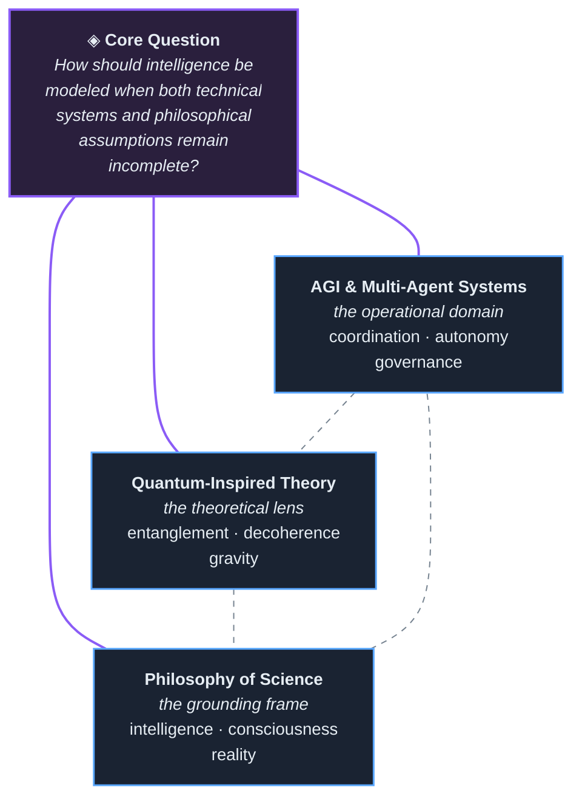

<div align="center">

<br>

```
Intelligence is coordination under incomplete knowledge.
I study where formal systems meet unfinished philosophy.
```

<br>

</div>

---

### About

Independent researcher at the intersection of artificial general intelligence, multi-agent systems, quantum-information theory, and foundational philosophy of science.

Academic background in engineering psychology, ergonomics, and radioengineering systems. That training shapes how I think about intelligence — not as computation alone, but as organization, adaptation, and coordination under constraint.

<br>

<div align="center">



</div>

<br>

---

### Research Domains

**Multi-Agent Intelligence** — the operational domain
Language-mediated coordination, autonomy boundaries, and governance structures in distributed agent systems. How agents negotiate, delegate, and maintain coherence without centralized control.

**Quantum-Inspired Conceptual Frameworks** — the theoretical lens
Entanglement, decoherence, and gravity not as experimental physics claims, but as formal tools for reasoning about correlation, coherence loss, and structural constraint in complex systems.

**Philosophy of Science & Foundations** — the grounding frame
First-principles inquiry into intelligence, consciousness, and reality. What does it mean for a system to "understand"? Where do our models of the world break, and what does that breakage reveal?

---

### Current Threads

```
▸ language-mediated coordination in multi-agent systems
▸ autonomy and governance under distributed agency
▸ entanglement and decoherence as conceptual tools for complex adaptive systems
▸ reality as process — toward a testable philosophical framework
▸ original thought in technological systems
▸ Theory of Everything as dynamic ontology
```

---

<div align="center">

<br>

*theory should compress complexity, not mystify it*

<br>

`engineering psychology` · `AGI` · `multi-agent coordination` · `quantum information` · `philosophy of science`

<br>

</div>
